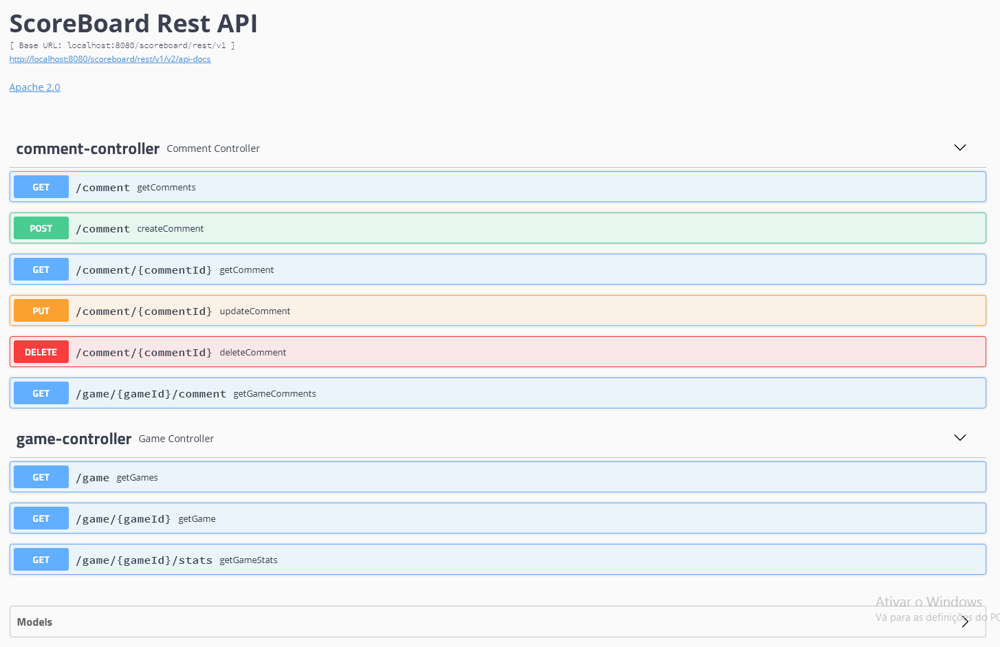

# ScoreBoard

ScoreBoard is a REST API built with Spring Boot that allows to search and comment on NBA historical game data.

## Getting Started

### Prerequisites

The following items are required to be installed on your system:
* [Git](https://github.com/)
* [Maven](https://maven.apache.org/)
* [OpenJDK](https://openjdk.java.net/)

The following items should be installed on your system for running ScoreBoard within docker:

* [Docker/Docker-compose](https://www.docker.com/)

#### Clone

To get started you can simply clone this repository using git:

```
git clone https://github.com/ro0t3d1/scoreboard.git
cd scoreboard
```

### Configuration 

The configuration is located in `src/main/resources/application.properties`.

#### Required


In order to get ScoreBoard to work you have to provide a valid key. You will need to sign-up for a free [RapidAPI account](https://rapidapi.com/). 

```
rapidapi.key = ${RAPIDAPI_KEY}
```

#### Optional

The application supports Basic Authentication on all endpoints. The default credentials are `scoreboard:scoreboard`. Define another or disable the authentication:
```
scoreboard.security.auth.enabled=${SCOREBOARD_SECURITY_AUTH_ENABLED}
scoreboard.security.username=${SCOREBOARD_SECURITY_USERNAME}
scoreboard.security.password=${SCOREBOARD_SECURITY_PASSWORD}
```

The application supports swagger, but is disabled by default. To enable swagger configure:
```
swagger.enabled=${SWAGGER_ENABLED}
```

### Installing


#### Build an executable JAR

Build a single executable JAR file:
```
mvn clean package
```
Then you can run the JAR file with:
```
java -jar target/scoreboard.jar
```
By default, the application requires a PostgreSQL database to work. For testing purposes, a spring profile `dev` is available. This profiles uses an in-memory database.
```
java -jar target/scoreboard.jar --spring.profiles.active=dev
```

#### Build with Docker

Build executable JAR file:
```
mvn clean package
```
Create docker images:
```
docker build -t scoreboard-app -f Dockerfile.scoreboard-app .
docker build -t scoreboard-db -f Dockerfile.scoreboard-db .
```

Provide RapidAPI key `docker-compose.yml`:
```
RAPIDAPI_KEY: INSERT_KEY_HERE
```
Then you can run the application with:
```
docker-compose up -d
```

## Try ScoreBoard

Open your browser :

`http://localhost:8080/scoreboard/rest/v1/swagger-ui.html`



Get health status:

`http://localhost:8080/scoreboard/rest/v1/metrics/health`

Get prometheus exposed metrics:

`http://localhost:8080/scoreboard/rest/v1/metrics/prometheus`

## Running the tests

The application tests are located in src/main/test/java. Try them out:

```
mvn test
```

## Versioning

This project uses [SemVer](http://semver.org/) for versioning. 

## Future Work

* Adding Hibernate Second-Level Cache.
* Adding an Auditing System on Rest API requests.

## Authors

* **ro0t3d** - [GitHub Profile](https://github.com/ro0t3d1)

## License

This project is licensed under the Apache License, Version 2.0 - see the [LICENSE](LICENSE) file for details

## Acknowledgments

* I really appreciate [Free NBA API](https://rapidapi.com/theapiguy/api/free-nba) for improving my patience when I was reading the project documentation.
